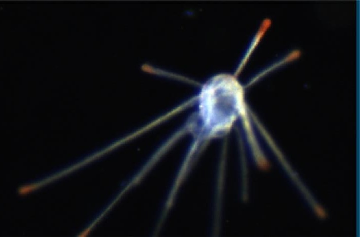
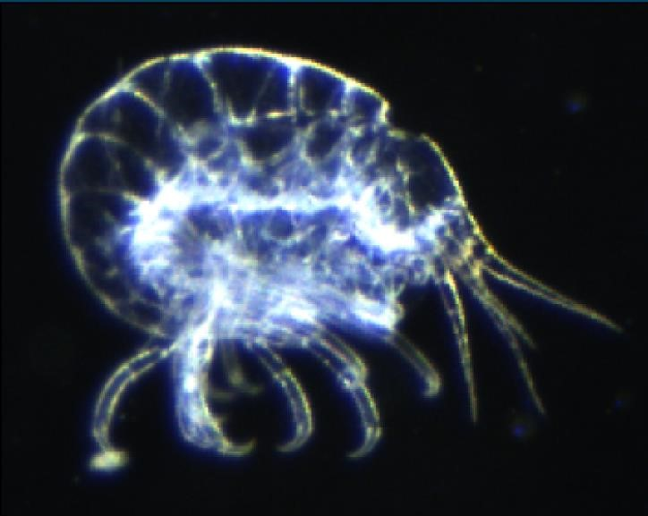
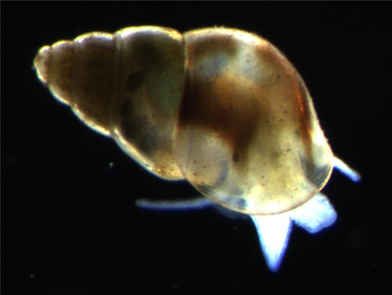
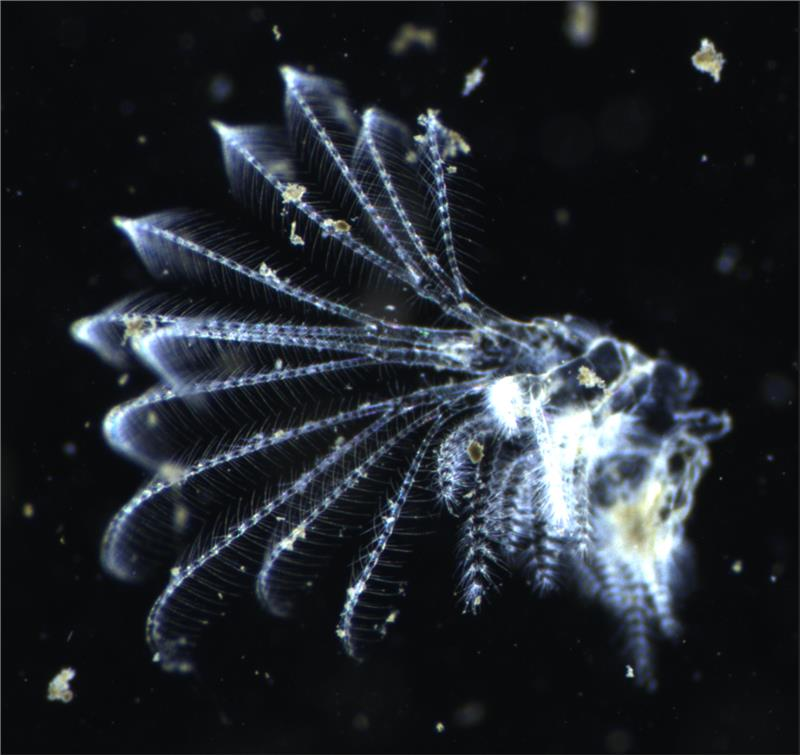
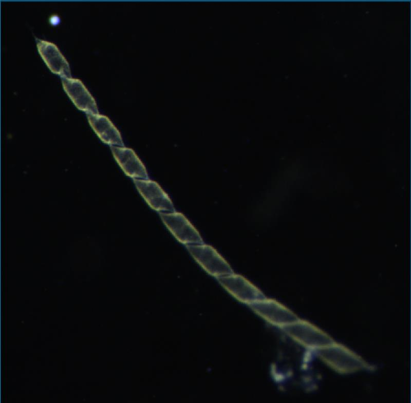

Plankton are diverse, drifting organisms that are crucial members of aquatic foodwebs. Marine and freshwater foodwebs are essential to human well-being as they generate > 50% of atmospheric oxygen and about one third of the meat consumed by humans. The critical role of plankton in conservation of aquatic biodiversity and human nutrition needs to be understood and the knowledge used to serve decision making in the face of global change.

In addition to sustaining aquatic life, plankton activity and debris sustainably sequester vast amounts of carbon from the atmosphere to the ocean’s interior. Atmospheric C02 would be 200 ppm higher without the existence of the plankton-driven biological carbon pump. This pump sequesters about 6 GtC per year to the oceans interior, which is approximately equal to all fossil fuel emissions. The efficiency of this biological carbon pump is likely altered by climatic changes that affect planktonic diversity. 

Distributed pelagic imaging techniques enable the sustained observation of plankton and debris, comprehensively covering the earth’s water bodies. To date, billions of images of aquatic organisms and particles have been acquired around the world, using a variety of in situ and benchtop systems, and millions of images are added every day. Each individual image can provide crucial information about the individual organism or particle, its role in carbon sequestration, biodiversity, and ecosystem status of the water body.

This information needs to be reliably extracted from plankton images by solving a set of highly relevant downstream tasks: (1) **Species classification** assigns taxonomic species or broader taxon group label to each image, (2) **trait-extraction** refers to the characterization of fitness-conferring functional properties of organisms (e.g. “with or without eggs”, ratio of prey/body size), and (3) **quantification of particulate organic carbon (POC)** which is critical for estimating biomass fluxes and the efficiency of the biological carbon pump.

Current AI-based approaches for pelagic images have tapped into comparatively small subsets of existing data. A dedicated system for plankton and particle image analysis that works across imaging instruments is lacking. Key challenges include an abundance of rare species with no or extremely few labelled data, scarcity of annotations due to expensive expert time.

The vast amounts of highly diverse data available, scarcity of labels and the distinct information content of pelagic images compared to standard computer vision data motivate the AqQua Foundation Model. There is huge potential for innovation by harmonising and leveraging the vast amounts of all available data for large-scale training. Such a model will establish consistency across imaging systems at likely disruptive downstream performance.

