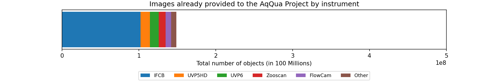
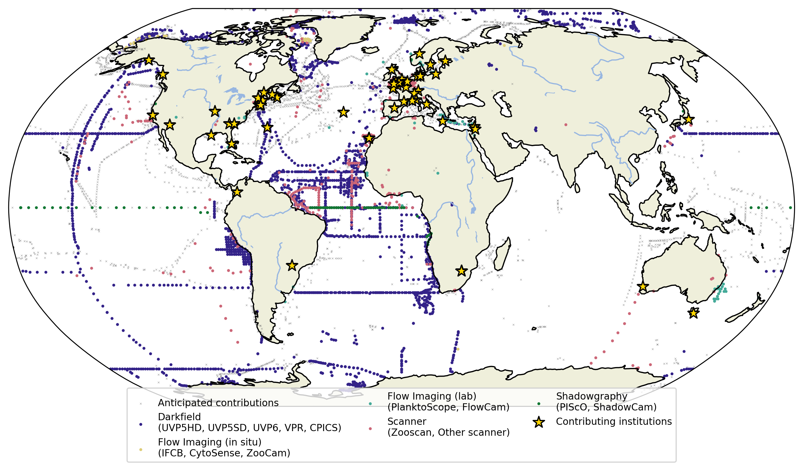

AqQua is building the world’s most comprehensive open dataset of plankton and particle images to power next-generation AI models for aquatic research.
The following figures visualize the current progress of the data collection.
The bar plot shows the number of images per instrument collected so far.
Every contribution strengthens the global foundation model, helping researchers better understand aquatic ecosystems in a changing world.
The map shows where data has already been collected and where collaborators have pledged future contributions.

<figure>
    <em>Please enable javascript to see a more detailed plot of the current state of the data collection effort!</em>  
    Overview of the images, split by instrument, already provided to the AqQua project so far:
    
    

    <label>
    <input type="checkbox" id="scaleToggle" />
    Use Logarithmic Scale
    </label>

    

        <canvas id="canvas"></canvas>
    

</figure>

<figure>
    
  <figcaption>Geographic distribution of plankton imaging datasets already collected by the AqQua project (colored dots, by instrument type) and anticipated contributions (light gray crosses) pledged by collaborators. Yellow stars mark contributing institutions.</figcaption>
</figure>

The goal of the AqQua project is to:

- Build an AI foundation model of plankton image data,
- Release it as an open-source tool for the global community for the purpose of facilitating everyone’s plankton-related research,
- Leverage it to develop global plankton- and particle distribution models and estimate related process rates.

To achieve this, the AqQua project is currently collecting plankton image datasets from a variety of imaging devices deployed across diverse aquatic habitats worldwide. To assemble a most diverse and extensive dataset, **we encourage scientists around the world to share their plankton- and particle image data**. We are very happy that we have already received overwhelming signals of support, with more than 40 academic labs and non-academic stakeholders across the globe pledging to share data and contribute expertise.

**Everyone sharing data will be included as author of a planned data paper**. Furthermore, everyone sharing data will be invited to actively contribute to a respective foundation model paper, as well as global distribution- and process rate papers. We therefore reach out to you, even if your data is already in the public domain. The AqQua foundation model will, most likely, perform favorably on the kinds of data it has been trained on, thus your research might benefit from sharing your data in the long-run. The AqQua project will **not** analyze any provided dataset in isolation nor perform any respective local analyses.

Due to our full commitment to Open Science, **all data shared with the AqQua project has to come with permission to be made publicly available on July 15, 2027** under [CC BY-NC 4.0](https://creativecommons.org/licenses/by-nc/4.0/deed.en) license as part of our planned data paper. Thus we are exclusively seeking data that is either already publicly available or can be made publicly available no later than July 15, 2027.

For the purpose of training a foundation model, AqQua requires image data (including scale information), as well as at least latitude, longitude, depth, date and time of observation. Classification labels (e.g. species or particle type) and trait annotations (e.g. egg-carrying) are very welcome as these can help fine-tune and benchmark the foundation model, but are not required. We would also appreciate it if you would share sample unit definition and the sampled volume information for your samples, to enable us to develop global distribution models and to estimate process rates (e.g. as in [Laget et al. 2024](https://doi.org/10.1038/s41467-024-47651-4), Clements et al. [2022](https://doi.org/10.1029/2021GB007276) & [2023](https://doi.org/10.1029/2022GB007633)). Image data of (mono)cultures is also welcome and in this case, metadata should indicate the original sampling location, date and time.

As production-run foundation model training will commence this fall, **the deadline for sharing data with AqQua is October 31, 2025**.

**To participate, please carefully read and fill the online form below**. Note, some filling instructions and exemplary answers are provided via mouseover questionmarks. After clicking the "Submit" button at the end of the form, you will receive an email with your filled form for your records.

Should you have any questions or suggestions, please check our **[FAQ]({{ 'faq' | relative_url }})** or contact us at [aqqua@geomar.de](mailto:aqqua@geomar.de). We would be happy to have you on board!

<!-- The Aquatic Life Foundation project (AqQua) aims to compile multimodal image datasets from contributing Helmholtz Centres, national and international partners to train a unified, accessible plankton image recognition model to help monitor and understand the health of our oceans. Vast contributions from the global community will complement data originating from Helmholtz centers and diverse, multimodal composition of the training data will ensure generalizability and performance of the AqQua Foundation Model. -->

<!-- Plot of how much data we collected so far and how much data we want to collect  -->

<!-- We welcome data contributions to our training dataset. If you believe that your data could be a valuable addition to our project, please reach out to us through the link below. -->

<!-- We at AqQua are grateful for your support and will duly acknowledge each data contribution. -->

<a class="data_collecting_btn" href="https://survey.hifis.dkfz.de/398984?lang=en"> >> Data inquiry form </a>
