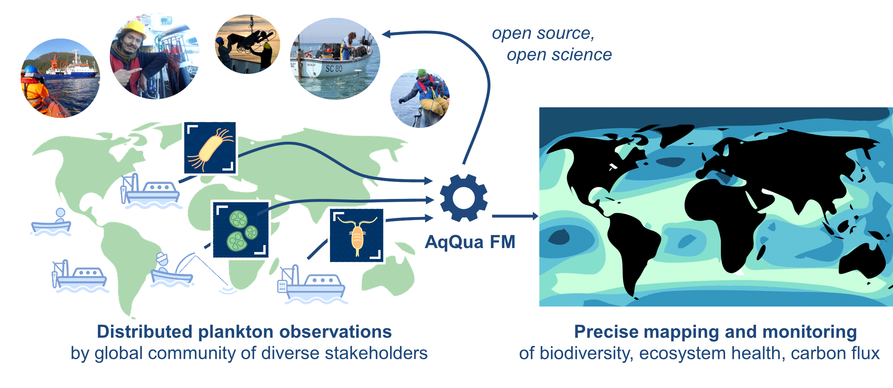

**Each day, millions of plankton images are acquired by researchers around the globe. Each individual data point provides information about biodiversity, functioning of aquatic foodwebs and ecosystem status of the related water body.**

**AqQua will leverage Europe's first exascale HPC to create the first foundational pelagic imaging model, consolidating billions of images from aquatic environments around the globe.**

**AqQua will provide critical data necessary for understanding the biological carbon pump — a natural process that sequesters vast amounts of carbon from the atmosphere and significantly affects global climate.**

AqQua is a Pilot Project in the [Helmholtz Foundation Model Initiative](https://hfmi.helmholtz.de).
